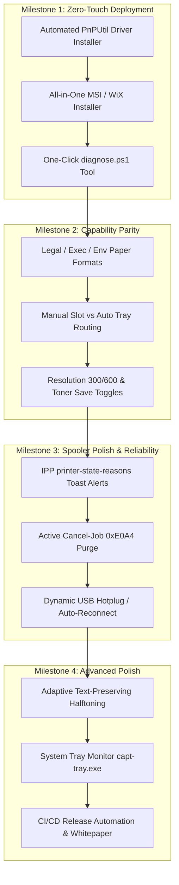

# Canon LBP-810 CAPT Service — Engineering Roadmap to Theoretical Perfect State

This roadmap outlines the path from the current functional MVP to a flawless, production-grade driver and service suite for the Canon LBP-810 on 64-bit Windows.

---

## 1. Roadmap Overview & Prioritization Matrix

The table below is sorted by **Priority** (from immediate high-impact essentials to advanced polish), cross-referenced with **Implementation Difficulty** (Trivial to Complex).

| Item | Focus Area | Priority | Difficulty | Status | Impact |
| :--- | :--- | :---: | :---: | :---: | :--- |
| **Silent WinUSB Driver Provisioning** | Installer | **P0** | **Medium** | ✅ **Done** (`install.ps1`) | Eliminates Zadig/manual Device Manager steps; installs driver with one click |
| **All-in-One MSI / WiX Installer** | Installer | **P0** | **Medium** | ⏳ Planned | Single standard Windows installer (.msi) with silent switch and clean rollback |
| **Extended Paper Formats (Legal, Exec, Env)** | Capabilities | **P1** | **Low** | ✅ **Done** | Native support for Legal, Executive, A5, B5, and Envelopes (DL, COM10, C5) |
| **Manual Feed Slot & Tray Selection** | Capabilities | **P1** | **Low** | ✅ **Done** | Auto-cassette (`0x01`) vs manual slot (`0x00`) selection via print properties |
| **Active Job Cancellation (`Cancel-Job`)** | Spooler / Core | **P1** | **Medium** | ✅ **Done** | Canceling from Windows Spooler sends `0xE0A4` to flush engine buffer cleanly |
| **Bidirectional Spooler Status (Toast Alerts)** | Spooler / UX | **P1** | **Medium** | ✅ **Done** | Native Windows alerts for "Out of Paper", "Door Open", "Paper Jam", "Cartridge Missing" |
| **Automated One-Click Diagnostics Script** | Tooling | **P1** | **Low** | ✅ **Done** (`diagnose.ps1`) | `diagnose.ps1` checks USB hardware, WinUSB binding, port 6631, and spooler health |
| **Comprehensive Protocol Whitepaper** | Documentation | **P1** | **Low** | ✅ **Done** (`docs/`) | Complete formal specification of CAPT v1 packet headers, opcodes, and SCoA format |
| **CI/CD Automated Build & Release Pipeline** | Infrastructure| **P1** | **Medium** | ✅ **Done** (`.github/`) | GitHub Actions matrix (Linux ASan/UBSan, MinGW cross-compile, MSVC native, MSI release) |
| **Resolution Selection (300 vs 600 DPI)** | Capabilities | **P2** | **Low** | ✅ **Done** | Allows selecting Draft/Fast (300 DPI) or High Quality (600 DPI) in print dialog |
| **Toner Save & Density Controls** | Capabilities | **P2** | **Low** | ✅ **Done** | Exposes toner saving mode (`toner_saving=0x01`) and 5-level density (0x00–0x1F) |
| **Adaptive Text-Preserving Halftoning** | Rendering | **P2** | **Medium** | ✅ **Done** | Sharp black/white thresholding for text/line art + Floyd-Steinberg for images |
| **Dynamic USB Hotplug & Auto-Recovery** | Core / USB | **P2** | **Medium** | ✅ **Done** | Seamless reconnect if printer is power-cycled or unplugged during service operation |
| **Lightweight System Tray Companion App** | UX / Tooling | **P2** | **Medium** | ⏳ Planned | System tray icon (`capt-tray.exe`) showing real-time status, quick test print, logs |
| **Windows Print Support App (PSA / WinUI 3)** | UX / Platform | **P3** | **High** | ⏳ Planned | Modern Windows 10/11 UWP/WinUI print preferences and notification extension |

---

## 2. Detailed Implementation Phases

### Phase 1: Zero-Touch Driver & Automated Production Installer
> **Priority: P0 (Critical)** &bull; **Difficulty: Medium** &bull; **Goal: Zero manual setup steps for end users**

Currently, the user must either run Zadig or manually navigate through Device Manager to install `capt-lbp810.inf`. The goal of Phase 1 is a commercial-grade, silent installation package.

#### 1.1 Automated WinUSB Driver Binding
- **Mechanism**: Use `pnputil.exe /add-driver capt-lbp810.inf /install` programmatically, or invoke Windows SetupAPI (`SetupCopyOEMInfW` and `UpdateDriverForPlugAndPlayDevicesW`).
- **Catalog & Signing**: Generate a self-signed catalog file (`capt-lbp810.cat`) and automatically import the local certificate into the machine's `TrustedPublisher` and `Root` certificate stores during setup, avoiding Windows unsigned driver warnings.
- **Hardware Fallback**: If the printer is not plugged in during installation, pre-stage the driver in the Windows Driver Store so that when plugged in later, Windows automatically binds `winusb.sys` without user intervention.

#### 1.2 All-in-One MSI / Inno Setup Installer
- **Delivery**: A single `Canon-LBP810-Setup-x64.msi` (built with WiX Toolset) or `.exe` (Inno Setup).
- **Installation Flow**:
  1. **Pre-flight Check**: Verifies 64-bit Windows, administrator privileges, and Print Spooler service state.
  2. **File Deployment**: Installs binaries into `C:\Program Files\Canon LBP-810 CAPT Service\`.
  3. **Driver Staging**: Pre-installs WinUSB INF to Driver Store via PnPUtil.
  4. **Service Registration**: Configures `CaptLBP810` service with Automatic start and restart-on-failure recovery.
  5. **Printer Creation**: Quietly adds the IPP printer pointing to `http://127.0.0.1:6631/printers/canon-lbp810`.
  6. **Self-Test Option**: Checkbox to send a test print upon installation completion.
- **Clean Uninstallation**:
  - Complete rollback: Stops and deletes service, removes printer device and port, cleans up Driver Store package, and deletes logs.

---

### Phase 2: Full Hardware & Protocol Capability Coverage
> **Priority: P1 (High)** &bull; **Difficulty: Low to Medium** &bull; **Goal: 100% hardware feature parity with the original 32-bit driver**

#### 2.1 Extended Paper Size Support
The Canon LBP-810 engine supports several paper formats beyond A4 and Letter. Each requires precise printable dimensions, margins, and paper size codes in the 34-byte `CAPT_BEGIN_PAGE` (`0xD0A0`) payload:

| Paper Name | Paper Code | Dimensions (mm / in) | Pixels at 600 DPI | Margin (L, T) | Printable Size |
| :--- | :---: | :--- | :--- | :---: | :--- |
| **ISO A4** *(implemented)* | `0x02` | 210 × 297 mm | 4960 × 7014 | (112, 119) | 4736 × 6776 (592 bytes/line) |
| **US Letter** *(implemented)* | `0x0D` | 8.5 × 11 in | 5100 × 6600 | (110, 120) | 4880 × 6360 (610 bytes/line) |
| **US Legal** | `0x0C` | 8.5 × 14 in | 5100 × 8400 | (110, 120) | 4880 × 8160 (610 bytes/line) |
| **Executive** | `0x0A` | 7.25 × 10.5 in | 4350 × 6300 | (100, 120) | 4150 × 6060 (520 bytes/line) |
| **ISO A5** | `0x03` | 148 × 210 mm | 3496 × 4960 | (100, 110) | 3296 × 4740 (412 bytes/line) |
| **JIS B5** | `0x07` | 182 × 257 mm | 4299 × 6070 | (100, 110) | 4099 × 5850 (513 bytes/line) |
| **Envelope COM10** | `0x05` | 4.125 × 9.5 in | 2475 × 5700 | (100, 120) | 2275 × 5460 (285 bytes/line) |
| **Envelope DL** | `0x0B` | 110 × 220 mm | 2598 × 5196 | (100, 110) | 2398 × 4976 (300 bytes/line) |
| **Envelope C5** | `0x08` | 162 × 229 mm | 3826 × 5409 | (100, 110) | 3626 × 5189 (454 bytes/line) |

- **IPP Configuration**: Advertise all formats in `media-supported`, `media-default`, and `media-ready` attributes in [`ipp_server.c`](file:///home/flak/temp/cube_01/canon-lbp810-win64/src/ipp_server.c).

#### 2.2 Input Slot Selection (Manual Feed vs Auto Cassette)
- The LBP-810 features two feed paths:
  1. **Main Auto Cassette** (`input_slot = 0x01`): Standard tray holding up to 125 sheets.
  2. **Manual Feed Slot** (`input_slot = 0x00`): Front slot for envelopes, thick stock, transparencies, and single sheets.
- **Implementation**: Inspect the PWG-Raster header's `media_position` or IPP `media-source` attribute:
  - `media-source = "manual"` &rarr; `input_slot = 0x00`
  - `media-source = "auto"` or `"tray-1"` &rarr; `input_slot = 0x01`
- When manual slot is selected, log a user prompt: `"Waiting for sheet in manual feed slot..."`.

#### 2.3 Resolution & Quality Controls
- **Resolution**: Support both `600 DPI` (standard) and `300 DPI` (draft).
  - Parse `hw_resolution_x` from PWG header; set `params->resolution = 0x11` (600 DPI) or `0x00` (300 DPI).
- **Toner Saving (Draft Mode)**:
  - Expose draft print-quality in IPP (`print-quality-supported: 3=draft, 4=normal, 5=high`).
  - Draft mode sets `params->toner_saving = 0x01` in CAPT page header, reducing toner consumption by ~30%.
- **Automatic Image Refinement (AIR) / Smoothing**:
  - Expose smoothing toggle: `params->smoothing = 0x02` (ON) vs `0x00` (OFF).

---

### Phase 3: Bidirectional Spooler Integration & Error Handling
> **Priority: P1 (High)** &bull; **Difficulty: Medium** &bull; **Goal: Real-time user feedback in Windows notification area**

#### 3.1 IPP `printer-state-reasons` Mapping
Currently, the service detects engine errors in [`status.c`](file:///home/flak/temp/cube_01/canon-lbp810-win64/src/status.c) and logs them. To surface these directly in the Windows UI, translate raw hardware flags into standard IPP state reasons:

| Hardware Engine Flag | Description | IPP `printer-state` | IPP `printer-state-reasons` | Windows User Experience |
| :--- | :--- | :---: | :--- | :--- |
| `0x0200` & `paper_slots=0` | Tray empty / Out of paper | `stopped` (5) | `media-empty-error` | Toast: "Printer is out of paper" |
| `aux & 0x08` == 0 | Front cover open | `stopped` (5) | `door-open-error` | Toast: "Printer door or cover is open" |
| `basic & 0x80` & Jam flag | Paper jam | `stopped` (5) | `media-jam-error` | Toast: "Paper jam in printer" |
| Cartridge sensor missing | Toner cartridge removed | `stopped` (5) | `marker-supply-missing-error` | Toast: "No toner cartridge installed" |
| `page_printing > 0` | Active printing | `processing` (4) | `none` | Status: "Printing..." |
| Ready and idle | Ready for jobs | `idle` (3) | `none` | Status: "Ready" |

#### 3.2 Mid-Job Cancellation
- **Problem**: When a user cancels a job from the Windows Print Queue, the spooler sends an IPP `Cancel-Job` request (operation `0x0008`).
- **Implementation**:
  1. Interrupt the active SCoA streaming loop.
  2. Transmit `CAPT_DISCARD_DATA` (`0xE0A4`) to flush any unprinted rasters from the printer's onboard FIFO buffer.
  3. Send `CAPT_RESET_ENGINE` (`0xE0A1`) and poll until `CMD_BUSY` clears.
  4. Return `successful-ok` for the IPP `Cancel-Job` request.

#### 3.3 Dynamic USB Hotplug & Resilient Reconnection
- If the printer is powered off or unplugged while the service is running, WinUSB handles become invalid.
- Implement an automatic reconnection backoff:
  - If a USB bulk read/write returns `ERROR_GEN_FAILURE` or `ERROR_DEVICE_NOT_CONNECTED`, cleanly call `capt_close()`.
  - Re-attempt device discovery every 2 seconds via `SetupDiGetClassDevs` without crashing the IPP server.
  - Hold queued IPP jobs in memory and resume transmission automatically once the USB link is re-established.

---

### Phase 4: Advanced Image Rendering & Halftoning
> **Priority: P2 (Medium)** &bull; **Difficulty: Medium** &bull; **Goal: Laser-crisp text with smooth photographic reproduction**

#### 4.1 Hybrid Adaptive Halftoning
- **Challenge**: Standard Floyd-Steinberg dithering diffuses errors across everything, which can introduce slight fuzziness/stippling along sharp letter boundaries on high-contrast text.
- **Solution**:
  - Implement a hybrid classifier:
    - Pixels with extreme values (near pure black `0x00` or pure white `0xFF`) within a 3x3 window are quantized directly using a high-fidelity threshold.
    - Continuous-tone areas (photographs, gradients, gray fills) pass through Floyd-Steinberg or Sierra-Lite error diffusion.
  - Result: Sharp, razor-clean typography with smooth photographic reproduction.

#### 4.2 Multi-Algorithm Dithering Library
- Offer alternative dithering kernels configurable via command-line or settings file:
  1. **Floyd-Steinberg** (Default standard)
  2. **Atkinson Dither** (High contrast, preserves highlights)
  3. **Ordered Bayer 8x8** (Clean geometric cross-hatch, zero boundary bleeding on technical line drawings/CAD)

---

### Phase 5: User Experience & Management Tooling
> **Priority: P2 (Medium)** &bull; **Difficulty: Medium to High** &bull; **Goal: Native desktop integration and effortless troubleshooting**

#### 5.1 One-Click Diagnostics Utility (`diagnose.ps1`)
Provide a standalone, zero-dependency troubleshooting script:
- [x] Check 1: USB hardware presence (`VID_04A9&PID_260A` present in PnP tree).
- [x] Check 2: USB driver verification (confirm bound to `WinUSB` and not `usbprint`).
- [x] Check 3: Windows Service status (`CaptLBP810` service running).
- [x] Check 4: TCP Loopback test (`127.0.0.1:6631` answering HTTP/IPP GET/POST).
- [x] Check 5: Windows Spooler queue inspection (detect stale or stuck jobs).
- [x] Check 6: Output recent 25 lines of `capt-service.log`.
- Outputs a clean, color-coded health summary with actionable fix recommendations.

#### 5.2 Lightweight System Tray Utility (`capt-tray.exe`)
A tiny (sub-1MB) background notification area icon:
- **Icon status**:
  - 🟢 Green: Printer Ready & Idle
  - 🟡 Blue/Yellow: Printing / Processing Page X of Y
  - 🔴 Red: Door open, paper jam, or out of paper
- **Context Menu Options**:
  - *Open Print Queue*
  - *Print Test Page*
  - *Restart Print Service*
  - *View Service Log*
  - *Diagnostics...*

---

### Phase 6: Production Documentation & Automated CI/CD
> **Priority: P1 (High)** &bull; **Difficulty: Low to Medium** &bull; **Goal: Comprehensive technical documentation and automated releases**

#### 6.1 Formal CAPT v1 Protocol Specification Whitepaper
Create `docs/CAPT_V1_PROTOCOL.md` documenting:
- Complete USB endpoint topology (Control EP0, Bulk IN `0x81`, Bulk OUT `0x02`).
- 4-byte framing protocol and BCD length decoding quirks.
- All 15 opcodes with payload layouts and response timing requirements.
- Full SCoA decompression state machine and opcode tables.
- Extended status byte definitions and engine error bitmasks.

#### 6.2 GitHub Actions CI/CD Pipeline
Create `.github/workflows/build.yml` with multi-platform verification:
```
- Linux Build & Unit Tests:
  - GCC / Clang on Ubuntu 24.04
  - Memory Sanitizers (AddressSanitizer + UndefinedBehaviorSanitizer)
  - 100% CTest pass requirement
- Cross-Compilation:
  - x86_64-w64-mingw32-gcc builds capt-service.exe
- Native Windows Build:
  - Windows-latest runner with MSVC (Visual Studio 2022)
  - Produces release artifacts:
    - capt-service-portable.zip
    - Canon-LBP810-Setup-x64.msi
```

---

## 3. Execution Sequence & Timeline



```
┌────────────────────────────────────────────────────────────────────────┐
│               Milestone 1: Zero-Touch Deployment (P0)                  │
│                                                                        │
│  ┌───────────────────────┐    ┌─────────────────────────────────────┐  │
│  │ Automated PnPUtil     │───▶│ All-in-One MSI / WiX Installer      │  │
│  │ Driver Provisioning   │    │ (silent install + clean rollback)   │  │
│  └───────────────────────┘    └──────────────────┬──────────────────┘  │
│                                                  │                     │
│                               ┌──────────────────▼──────────────────┐  │
│                               │ One-Click diagnose.ps1 Utility      │  │
│                               └─────────────────────────────────────┘  │
└──────────────────────────────────────────────────┬─────────────────────┘
                                                   │
                                                   ▼
┌────────────────────────────────────────────────────────────────────────┐
│               Milestone 2: Capability Parity (P1)                      │
│                                                                        │
│  ┌───────────────────────┐    ┌─────────────────────────────────────┐  │
│  │ Extended Paper Sizes  │───▶│ Manual Slot vs Auto Cassette Tray   │  │
│  │ (Legal, Exec, Env)    │    │ (IPP media-source routing)          │  │
│  └───────────────────────┘    └──────────────────┬──────────────────┘  │
│                                                  │                     │
│                               ┌──────────────────▼──────────────────┐  │
│                               │ Resolution (300/600 DPI) & Economy  │  │
│                               └─────────────────────────────────────┘  │
└──────────────────────────────────────────────────┬─────────────────────┘
                                                   │
                                                   ▼
┌────────────────────────────────────────────────────────────────────────┐
│            Milestone 3: Spooler Polish & Reliability (P1)              │
│                                                                        │
│  ┌───────────────────────┐    ┌─────────────────────────────────────┐  │
│  │ IPP Spooler Reasons   │───▶│ Active Cancel-Job Handling          │  │
│  │ (Native Toast Alerts) │    │ (0xE0A4 Buffer Purge & Reset)       │  │
│  └───────────────────────┘    └──────────────────┬──────────────────┘  │
│                                                  │                     │
│                               ┌──────────────────▼──────────────────┐  │
│                               │ Dynamic USB Hotplug & Auto-Recovery │  │
│                               └─────────────────────────────────────┘  │
└──────────────────────────────────────────────────┬─────────────────────┘
                                                   │
                                                   ▼
┌────────────────────────────────────────────────────────────────────────┐
│                 Milestone 4: Advanced Polish (P2/P3)                   │
│                                                                        │
│  ┌───────────────────────┐    ┌─────────────────────────────────────┐  │
│  │ Adaptive Text-        │───▶│ Lightweight System Tray Monitor     │  │
│  │ Preserving Halftoning │    │ (capt-tray.exe quick-access icon)   │  │
│  └───────────────────────┘    └──────────────────┬──────────────────┘  │
│                                                  │                     │
│                               ┌──────────────────▼──────────────────┐  │
│                               │ CI/CD GitHub Actions & Whitepaper   │  │
│                               └─────────────────────────────────────┘  │
└────────────────────────────────────────────────────────────────────────┘
```

